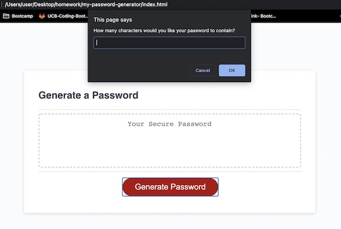
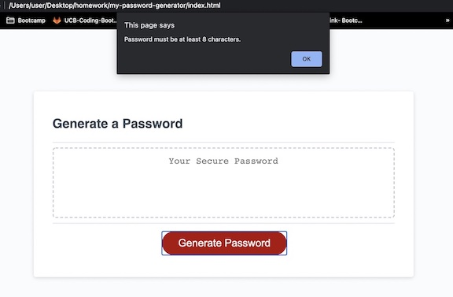
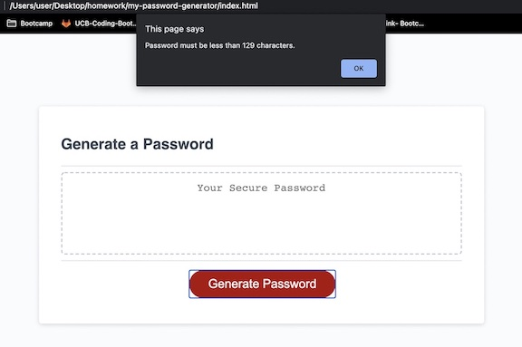

# Password Generator

This application is a random password generator that cycles through numbers, upper and lowercase letters, as well as special characters to provide employees with a randomized password. The user will be allowed to select the types of characters they would like from the choices previously stated as well as the length of password within certain predefined paramenters.
______________
#### *Password Generator Initiates* 
 The password generator begins with a prompt to help define the parameters of the password. 


The generator requires certain base parameters such as a length of password between 8 and 129. Anything outside of these parameters will return an message defining the character length options. 



 

## **Built With**
* [HTML](https://developer.mozilla.org/en-US/docs/Web/HTML)
* [CSS](https://developer.mozilla.org/en-US/docs/Web/CSS)
* [Git Hub](https://github.com/)
*  Git - used to track changes to code
_____________________________________________________
  

#### **Code Snippet**

I defined the length of the password to be between 8 and 128 characters by writing an if else statement. The final "else" doesn't need to be defined because it is simply the alternative result of the other two statements.

```
if (characterCount <= 7){
    alert ("Password must be at least 8 characters.")
  } else if (characterCount >= 129){
    alert ("Password must be less than 129 characters.")
  } else { 
  }
```


______________________________________________________________________________


#### **Deployed Link**

* [See Live Site](https://pamela-gutierrez.github.io/my-password-generator/)

### **Author Links**

* **PAMELA GUTIERREZ**
* **UC Berkeley Coding Bootcamp**
  
- [Link to Portfolio Site](#)
- [Link to Github](https://github.com/pamela-gutierrez) 
- [Link to LinkedIn](www.linkedin.com/in/pamela-gutierrez)


______________________________________________________________________________

#### **License**

This project is licensed under the MIT License


   